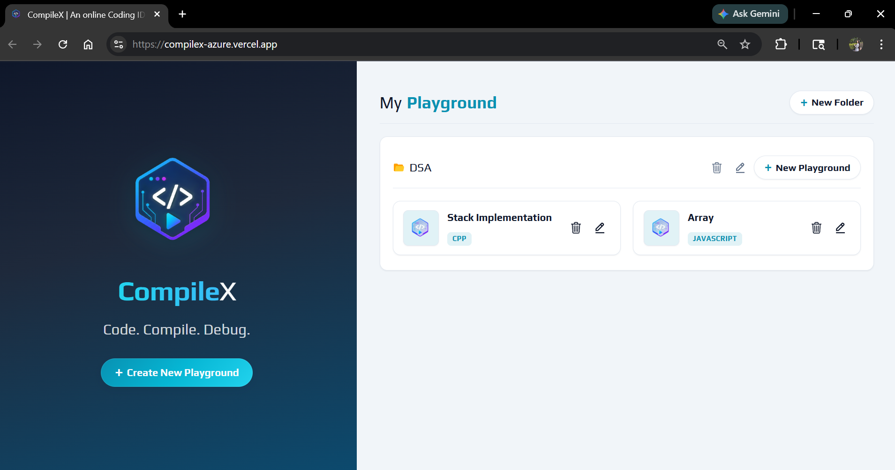

# CompileX | An Online IDE


CompileX is a web-based online code editor that allows users to write, run, and manage code snippets in multiple programming languages using the Judge0 API.

## Demo



Live demo: [compilex-azure.vercel.app](https://compilex-azure.vercel.app/)

## Features

- Execute code in multiple programming languages
- Support for C++, Python, Java, and JavaScript
- Multiple editor themes
- Upload and download source code
- Input and output console
- Save multiple playgrounds in Local Storage
- Fullscreen editor support

## Technologies Used

- React JS — for frontend
- Styled Components — for styling
- Judge0 CE API — to create and get submissions
- Rapid API — to Setup Judge0 CE API
- Axios — to make API calls
- React Router — for routing

## Getting started

```bash
git clone https://github.com/gurmehakk20/CompileX.git
cd CompileX
npm install
npm start
```

### Environment variables

Create a `.env` file in the project root (same folder as `package.json`). Only variables prefixed with `REACT_APP_` are exposed to the browser in Create React App.

```env
REACT_APP_RAPID_API_KEY=your_rapidapi_key_here
```

Get a key from [Judge0 CE on RapidAPI](https://rapidapi.com/judge0-official/api/judge0-ce). Restart the dev server after changing `.env`.

## Future Enhancements

- User authentication
- Cloud-based code storage
- Shareable playground links
- Collaborative coding
- Execution history

## Links & References

- [Live Project Link](https://compilex-azure.vercel.app)
- [Judge0 CE API Testing](https://rapidapi.com/judge0-official/api/judge0-ce)
- [Judge0 CE API Documentation](https://ce.judge0.com/)
- [Styled Component Documentation](https://styled-components.com/docs/basics) — styling
- [CodeMirror](https://uiwjs.github.io/react-codemirror/) — code editor
- [Vercel](https://vercel.com/) — hosting

## Author

Gurmehak Kaur

## Author

Gurmehak Kaur

GitHub: [gurmehakk20](https://github.com/gurmehakk20)<br>
LinkedIn: [gurmehak-kaur2004](https://www.linkedin.com/in/gurmehak-kaur2004)